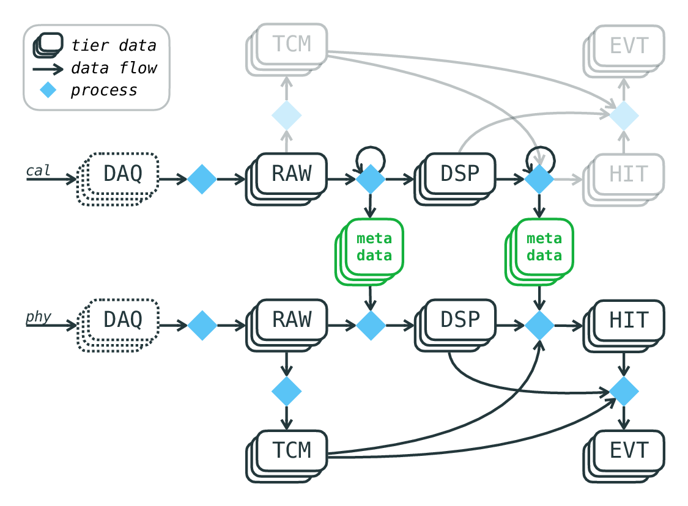

# LEGEND Data, Ref Cycles and Tiers
### Location
Check the `computing` tab on Confluence for more information. https://legend-exp.atlassian.net/wiki/spaces/LEGEND/pages/261750968/Computing. 

For NERSC, the data is located at `/global/cfs/cdirs/m2676/data/lngs/l200/public/`. 

### File Hierarchy
At the time I'm writing this document, the file hierarchy looks like this (three levels):
```
.
├── prodenv
│   ├── containers
│   │   (skipped)
│   ├── filelists
│   │   (skipped)
│   ├── jl-prod-orig
│   │   └── ref
│   ├── prod-blind
│   │   ├── auto
│   │   ├── ref
│   │   └── tmp
│   └── prod-orig
│       └── ref
└── sandbox -> ../private/sandbox
```

The `prod-blind` directory stores most of the data we need. The generated data are separated into three categories: `auto`, `ref`, and `tmp`, which corresponds to different stabliity. The stable release data are in `ref`. 

Let's look inside `ref` (only partially listed):
```
(legend-dataflow) hungwei@login38:~/l200/public/prodenv/prod-blind/ref> ls -l
lrwxrwxrwx  1 lgdata legend     6 Jan 25 08:22 latest -> v2.1.5
lrwxrwxrwx  1 lgdata legend     6 May 22 06:59 napoli26 -> v3.3.0
drwxr-s--x  6 lgdata legend  4096 Jan 25 08:17 v1.0.0
drwxr-s--x  6 lgdata legend  4096 Jun  8 13:08 v1.0.1
drwxr-s--x  6 lgdata legend 16384 Jan 25 21:33 v2.0.0
drwxr-s--x  7 lgdata legend  4096 Jan 25 21:34 v2.1.0
drwxr-s--x  6 lgdata legend  4096 Jan 25 08:18 v2.1.1
drwxr-s--x  6 lgdata legend  4096 Jan 25 08:18 v2.1.2
```
Each directory is a copy of `legend-dataflow` repository. The version tag does not align with the version of `legend-dataflow` repository. I'm not sure which repository's versions do those tags correspond to, but we could at least easily tell which dataset is older/newer. 

If you cd into any one of these, you would probably see the followings (only the important ones):
```
(legend-dataflow) hungwei@login38:~/l200/public/prodenv/prod-blind/ref/v3.0.0> ls -l
total 86
-rw-r----- 1 lgdata legend  2687 Feb  6 16:36 dataflow-config.yaml
drwxr-s--- 3 lgdata legend  4096 Sep 16  2025 docs
drwxr-s--- 7 lgdata legend  4096 Sep  1  2025 generated
drwxr-s--- 9 lgdata legend 16384 Aug 31  2025 inputs
drwxr-s--- 5 lgdata legend  4096 Sep 16  2025 workflow
```

#### Explanation
- `workflow` and `dataflow-config.yaml`: Snakemake stuff. Explained in next section. 
- `docs`: Some documents you could read if you're interested in how legend-dataflow works
- `generated`: Generated data. **LOOK FOR DATA HERE**
- `inputs`: Metadata and configs. You could find the function expression of each output field in the lh5 files. 

Finally, look inside `generated`:
```
(legend-dataflow) hungwei@login38:~/l200/public/prodenv/prod-blind/auto/v2.0.0/generated> tree -L 3 -d -I 'log|benchmark'
.
├── par
│   ├── dsp
│   │   ├── cal
│   │   ├── lac
│   │   ├── phy
│   │   ├── rdc
│   │   ├── ssc
│   │   └── tst
│   ├── filedb
│   ├── hit
│   │   └── cal
│   ├── pht
│   └── psp
├── plt
│   ├── dsp
│   │   └── cal
│   └── hit
│       └── cal
├── tier
│   ├── dsp
│   │   ├── bkg
│   │   ├── cal
│   │   ├── fft
│   │   ├── hvs
│   │   ├── lac
│   │   ├── lac_old
│   │   ├── phy
│   │   ├── pul
│   │   ├── pzc
│   │   ├── rdc
│   │   ├── ssc
│   │   └── tst
│   ├── evt
│   │   ├── bkg
│   │   ├── cal
│   │   ├── fft
│   │   ├── hvs
│   │   ├── lac
│   │   ├── lac_old
│   │   ├── old_lac
│   │   ├── phy
│   │   ├── pul
│   │   ├── pzc
│   │   ├── rdc
│   │   ├── ssc
│   │   └── tst
│   ├── hit
│   │   ├── bkg
│   │   ├── cal
│   │   ├── fft
│   │   ├── hvs
│   │   ├── lac
│   │   ├── lac_old
│   │   ├── phy
│   │   ├── pul
│   │   ├── pzc
│   │   ├── rdc
│   │   ├── ssc
│   │   └── tst
│   ├── raw -> ../../../../ref/v3.0.0/generated/tier/raw
│   └── tcm
│       ├── bkg
│       ├── cal
│       ├── fft
│       ├── hvs
│       ├── lac
│       ├── phy
│       ├── pul
│       ├── pzc
│       ├── rdc
│       ├── ssc
│       └── tst
```

#### Explanation
- First level - `par`, `tier`, `plt`, `log`, `tmp`: `par` means parameters, which store the calibration results such as ADC/keV ratio in hit tier. `tier` is where you find the generated lh5 files, `log` and `tmp` are literally what they are, and I don't know what `plt` is. 
- Second level - `hit`, `dsp`, `evt`, etc. See next section. 
- Third level - `cal`, `phy`, `pul`, `ssc`, etc: Datatype. Usually represents different experimental conditions. `cal` and `phy` are the standard ones. In `cal` data we put sources into all insert systems, and we use this portion of data for calibration. In `phy` data we don't put any sources, and these are the ones that should be used for final physcis analysis. The others are special runs. e.g., `ssc` only exist in r16. Each run only last for 12 hours and we only put single source within the system. One could find the information of each run in QCP:Data Taking https://legend-exp.atlassian.net/wiki/spaces/LEGEND/pages/1599963139/QCP+Data+Taking. 

# legend-dataflow repository 
URL: https://github.com/legend-exp/legend-dataflow

We will only talk about it briefly here. Read its README for more information. 

All LEGEND data that are stored in previous manner are generated by `legend-dataflow` using snakemake. You could consider this repository as the main script, and all the other packages such as `dspeed`, `pygama`, and `lgdo` are just dependencies of this script. They only provide functions that are imported into the scripts within this repository. 

We have already explained the other directories in this repository (`inputs`, `generated`, etc). Let's now look at `workflow/`:

```
(legend-dataflow) hungwei@login38:~/legend-dataflow-new> tree workflow/ -d
workflow/
├── profiles
│   ├── default
│   ├── lngs
│   ├── lngs-build-raw
│   └── sator
├── __pycache__
├── rules
│   ├── ann.smk
│   ├── blinding_calibration.smk
│   ├── blinding_check.smk
│   ├── channel_merge.smk
│   ├── common.smk
│   ├── dsp_pars_geds.smk
│   ├── dsp_pars_spms.smk
│   ├── dsp.smk
│   ├── evt.smk
│   ├── hit_pars_geds.smk
│   ├── hit.smk
│   ├── main.smk
│   ├── (......)
└── src
```
This directory contains the SnakeFile and rule files `*.smk`. After running the snakemake command with specified target, Snakemake will search from all the rules it have and attempt to create a procedure "DAG tree" that list the steps to create the final output from existing inputs. A rule block might look like this:
```
rule autogen_output:
    input:
        filelist=Path(filelist_path(config)) / "{label}-{tier}.filelist",
    output:
        gen_output="{label}-{tier}.gen",
        summary_log=Path(log_path(config))
        / f"summary-{{label}}-{{tier}}-{timestamp}.log",
        warning_log=Path(log_path(config))
        / f"warning-{{label}}-{{tier}}-{timestamp}.log",
    log:
        Path(tmp_log_path(config)) / time / "{label}-{tier}-complete_run.log",
    threads: min(workflow.cores, 64)
    params:
        valid_keys_path=Path(pars_path(config)) / "valid_keys",
        filedb_path=Path(pars_path(config)) / "filedb",
        ignore_keys_file=Path(det_status) / "ignored_daq_cycles.yaml",
        setup=lambda wildcards: config,
        basedir=workflow.basedir,
    script:
        "../src/legenddataflow/scripts/flow/complete_run.py"
```
A lot of "wildcards" need to be replaced with correctly computed variables. Those are handled by Snakemake. 

However, for us who just want to know how the procedure is structured, we would not want to go through the computation ourselves. Therefore, I forked the dataflow repo, and tried to do some dry runs myself. (Repo URL: https://github.com/hungwei59079/legend-dataflow-fork-new) 


Source: https://legend-exp.atlassian.net/wiki/spaces/LEGEND/pages/812187742/LEGEND-200+Data


From this flow chart I roughly know that the final target should be `evt` (Technically `skm` is the highest tier. However skm will require `pht`, `psp`, and `pet`, the partition version of `hit`, `dsp`, and `evt`. I need to understand more about partitions to figure out the workflow for that.) I used a AI-generated script to parse the output of Snakemake dry run, and I eventually get something like this: 
```
Step 1 [stage 0]: rule build_pars_dsp_tau_spms (155 jobs)
Input: /global/cfs/cdirs/m2676/data/lngs/l200/public/prodenv/prod-blind/auto/v2.0.0/generated/tier/raw/phy/p03/r001/l200-p03-r001-phy-20230318T015140Z-tier_raw.lh5, /global/u2/h/hungwei/legend-dataflow-new/inputs/dataprod/overrides/dsp/cal/p03/r000/l200-p03-r000-cal-T%-par_dsp-overwrite.yaml
   ... (+ 773 more items)
Output: /global/cfs/cdirs/m2676/data/lngs/l200/public/prodenv/prod-blind/auto/v2.0.0/generated/par/dsp/phy/p03/r001/l200-p03-r001-phy-20230318T015140Z-par_dsp_spms.yaml, /global/cfs/cdirs/m2676/data/lngs/l200/public/prodenv/prod-blind/auto/v2.0.0/generated/par/dsp/phy/p03/r001/l200-p03-r001-phy-20230318T025144Z-par_dsp_spms.yaml
   ... (+ 153 more items)
Script/Shell: Shell command: PRODENV=/global/cfs/cdirs/m2676/data/lngs/l200/public/prodenv/prod-blind/auto/v2.0.0 LGDO_BOUNDSCHECK=false DSPEED_BOUNDSCHECK=false PYGAMA_PARALLEL=false PYGAMA_FASTMATH=false TQDM_DISABLE=true /global/cfs/cdirs/m2676/data/lngs/l200/public/prodenv/prod-blind/auto/v2.0.0/.snakemake/legend-dataflow/venv/bin/par-spms-dsp-trg-thr-multi  
(...... a lot more flags)
----------------------------------------
Step 2 [stage 0]: rule build_svm_dsp_geds (1 jobs)
Input: None
Output: /global/cfs/cdirs/m2676/data/lngs/l200/public/prodenv/prod-blind/auto/v2.0.0/generated/par/dsp/cal/p03/r001/l200-p03-r001-cal-20230317T211819Z-par_dsp_svm.pkl
(30 more steps)
```
This tells us what exactly is done from raw data to evt tier in detail. Now we know which shell script to look at. 

# Example: `build_evt` rule breakdown